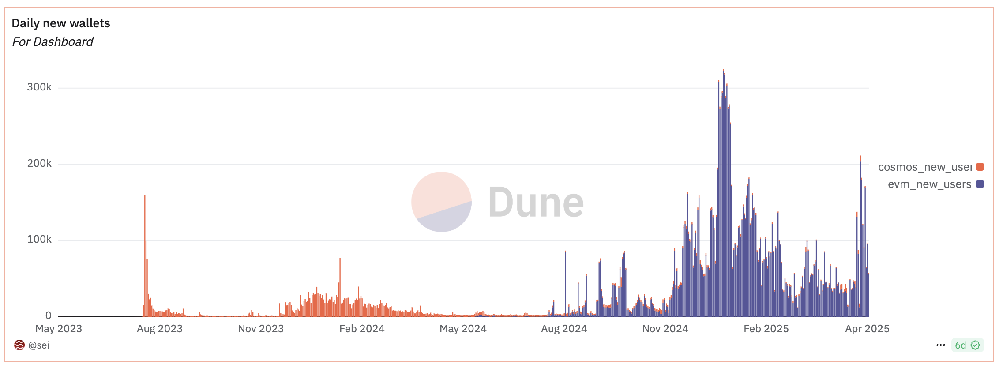

**SIP-3: Deprecating CosmWasm & Cosmos**

| SIP-Number | 3 |
| :---- | :---- |
| Title | EVM only |
| Description | Evolve Sei to be EVM only |
| Author | [Philip Su](http://philip@seinetwork.io) |
| Reviewer | [Bryan Tran](mailto:bryan@seinetwork.io) |
| Type | Standard (Core) |
| Created | 05/07/2025 |
| Status | Living |
| Comments | https://github.com/sei-protocol/sips/discussions/9 |

## **Current State of Sei**

Sei currently supports both EVM and native Cosmos accounts, along with interoperability between EVM and WasmVM-based applications. While this dual architecture has provided flexibility, it also introduces significant complexity and friction for both users and developers:

- Address linking: Users are required to manage and link both EVM and native addresses.
- Infrastructure burden: Indexers, explorers, and node providers must implement custom logic to support interoperability between the two environments.
- Code complexity: Maintaining cross-compatibility introduces unnecessary overhead in the codebase and complicates debugging and testing.

Since the introduction of Sei v2, EVM usage has rapidly grown to dominate network activity:   

## **Proposal**

This proposal recommends deprecating CosmWasm and native Cosmos transactions in favor of a streamlined, EVM-only architecture. Specifically, the proposal recommends that:

- Only EVM addresses will be allowed to initiate transactions on Sei.
- The network will support EVM-only transactions going forward.
- CosmWasm contracts and native Cosmos message handling will be deprecated and removed.

Note that Sei addresses may still be used internally by the protocol (e.g. validator addresses), and core functionality such as staking and governance will remain available through [precompiles](https://github.com/sei-protocol/sei-chain/tree/main/precompiles).

## **Technical Milestones**

At a high level, there are a few major milestones:

1. Create EVM Pointers: Ensure all Cosmos and CosmWasm assets are accessible from the EVM side via pointers.
2. Deprecate New CosmWasm Deployments: Disable instantiation of new CosmWasm contracts. Disable inbound IBC transfers
3. Disable Legacy Interactions: Disable remaining CosmWasm contract execution and transaction support for non-EVM addresses.

## Potential Impact

This rollout does have the following potential impact which developers and users will need to be aware of:

* Infra: Infra teams such as RPC providers and indexers will need to ensure that they are solely interacting with EVM APIs
* Users: Users will need to migrate assets to EVM-native wallets and/or exit Cosmos & CosmWasm native assets through bridging, swapping, or withdrawal mechanisms
* Application Developers: CosmWasm developers will need to port their applications to EVM and integrate EVM-compatible frontends.

## **Rationale**

Moving to an EVM-only architecture will significantly simplify the Sei developer and user experience, reduce infrastructure overhead, and position Sei more strongly within the broader EVM ecosystem. This transition will lead to greater adoption, improved developer experience, and a more cohesive community.

## **Copyright**

CC0 1.0.
