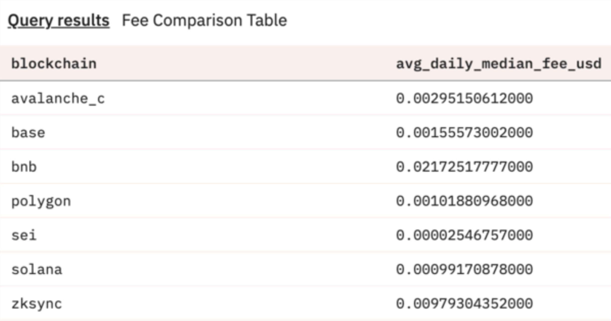

**SIP-4: Changing EIP-1559 parameters to increase throughput, reduce volatility and improve developer experience.**

| SIP-Number | 4 |
| ----- | ----- |
| Title | Changing EIP-1559 parameters to increase throughput, reduce volatility and improve developer experience. |
| Description | Update EIP-1559 params to increase capacity and reduce spam. |
| Author | [Jeremy Wei](mailto:jeremy@seinetwork.io)           |
| Reviewer | [Philip Su](mailto:phil@seinetwork.io)           |
| Type | Standard (Core)                                    |
| Created | 11/20/2025                                         |
| Status | Living                                             |
| Comments | https://github.com/sei-protocol/sips/discussions/11 |

## **Context/Background**

Sei currently supports a flavor of EIP-1559 used mostly for spam prevention. At a high-level, there is a base fee per gas that all transactions need to pay to be included in the next block. The base fee fluctuates depending on how full the previous block is in terms of gas, but cannot go below the minimum base fee or above the maximum base fee.

Specifically, if the previous block contains more gas than the target block gas used, the base fee is increased by a percentage proportional to how full the block is. Conversely, if the previous block contains less gas than the target block gas used, the base fee decreases by a percentage proportional to how empty the block is. The base fee therefore is updated every block depending on how full the previous block is in terms of gas.

The target block gas used and the minimum/maximum base fee are all chain parameters and can be changed. The current relevant values for these are:

- Target block gas used: 850,000
- Minimum base fee: 1gwei
- Average fee: ~3 gwei
- Maximum base fee: 1000gwei

## **Challenges**

As the network’s usage continues to grow in usage, and there is more incentive for spam, the median gas per block has approached the 850k target gas per block. While network usage is always a good thing, the median target gas growing means that gas prices have steadily increased. In certain cases, network demand has pushed gas fees to increase exponentially, causing trouble for those who are not dynamically adjusting their gas fees fast enough.

## **Proposal**

Sei Labs and a number of key ecosystem contributors conducted rigorous testing and believe this number could conservatively be raised to 2M gas per block without impacting performance, meaning more gas per block and thus more transaction capacity. Therefore, we propose to more than double the target block gas used to 2M. This will significantly increase pacific-1’s capacity for more transactions at cheap gas prices with the limit remaining at 10M.

To counteract the change above, we also propose to increase the minimum base fee from 1gwei to 10gwei, a ~3x increase from today's 3 gwei average in order to combat fee volatility from spam transactions. 

## **Risks**

At the chain level, there is no significant risk to increasing the target gas used to 2M as we are not changing the maximum capacity that the chain can handle, which is the block gas limit of 10M.

Increasing the minimum base fee may increase the transaction costs for some users. However, even with the increased cost, Sei will still be significantly cheaper than other comparable chains. To put this into perspective, the current average transaction cost on Sei is $0.000025, which is ~40x cheaper than Solana and ~62x cheaper than Base. Since the average gas price on pacific-1 is currently ~3gwei, we will expect the average gas price will increase by 3.3x and stay near the 10gwei minimum base fee. This is because the increased target will reduce spam transactions and keep gas prices near the minimum base fee. After this change, Sei’s average transaction cost will still be ~12x cheaper than Solana and 18.8x cheaper than Base.

Overall, Sei’s network growth has been incredibly inspiring, and we are pleased to see more than 16M monthly active users of the chain as of September 2025. This usage makes Sei the #1 EVM chain by UAWs across multiple time frames according to dappradar, and positions Sei at the forefront of EVM scaling. With this growth, comes optimizations for the network that can help to reduce volatility and improve developer experience. We believe that SIP-4 will make a notable difference in these areas, while still maintaining Sei’s position as the cheapest and fastest chain in production by an order of magnitude. 
